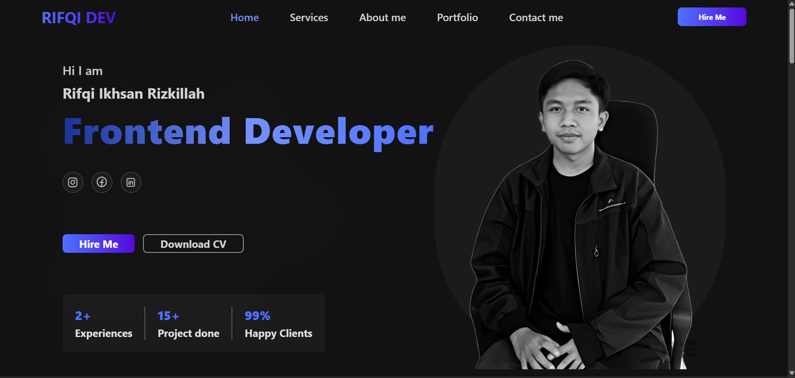

# 🌐 Rifqi Ikhsan Rizkillah — Personal Portfolio Website

Welcome to my personal portfolio website!  
This site is built to showcase my work, experience, and capabilities as a Frontend Developer & Creative Thinker.

🔗 **Live Site:** [https://rifqiikhsan-portfolio.netlify.app](https://rifqiikhsan-portfolio.netlify.app)

---

## 📸 Preview



---

## ✨ Features

- Responsive design for desktop, tablet, and mobile
- Modern tech stack: React + Vite + Tailwind CSS
- Animated elements using AOS (Animate On Scroll)
- Portfolio project filter by category
- Clean and minimal UI/UX
- Deployed via Netlify

---

## 🛠️ Tech Stack

| Tech         | Description                            |
| ------------ | -------------------------------------- |
| React.js     | JavaScript library for building the UI |
| Tailwind CSS | Utility-first CSS framework            |
| Vite         | Build tool for faster dev & build time |
| AOS          | Library for scroll animations          |
| Netlify      | Deployment platform                    |
| Google Fonts | Typography styling                     |

---

## 🚀 Getting Started

To run this project locally:

### 1. Clone the repository

```bash
git clone https://github.com/yourusername/rifqi-portfolio.git
cd rifqi-portfolio
```

### 2. Install dependencies

```bash
npm install
```

### 3. Run development server

```bash
npm run dev
```

Visit `http://localhost:5173` in your browser.

---

## 🔧 Build for Production

```bash
npm run build
```

The final output will be in the `dist/` folder. You can deploy it to platforms like Netlify, Vercel, or your own hosting.

---

## 📌 Customize

If you want to use this as a template:

- Update personal info in `About.tsx`
- Change project data in `Portfolio.tsx` or create a JSON file
- Replace assets (images, favicon, etc.) in `/public` and `/src/assets`
- Adjust Tailwind theme in `tailwind.config.js`

---

## 📬 Contact

If you'd like to collaborate, have feedback, or just say hi:

- 🌐 [Website](https://rifqiikhsan-portfolio.netlify.app)
- 📧 Email: rifqiikhsan45@gmail.com
- 💼 LinkedIn: [linkedin.com/in/rifqiikhsan](https://linkedin.com/in/rifqiikhsan)

---

## 📝 License

This project is open source and available under the [MIT License](LICENSE).

---

**Thank you for visiting my portfolio!**
